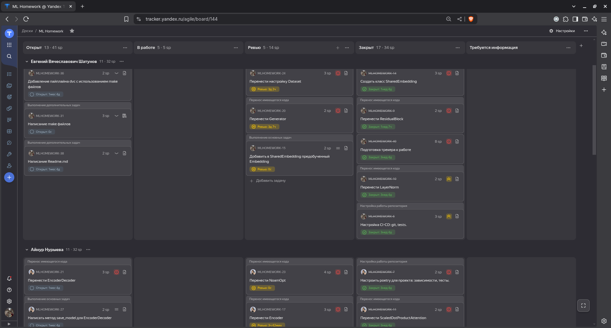

# HW_4
Реализация Prototypical Network в рамках домашней работы по курсу ML. Модель описана в README.md (ml_mipt_dafe/08_Self_Super...  @GitHub) и более полно в оригинальной статье (Prototypical Networks for ...  @arXiv.org). 


Проект выполнен студентами 3 курса МФТИ ПИШ ФАЛТ:
* Ищенко Игорем Олеговичем
* Нурыевой Айнур
* Шатуновым Евгением Вячеславовичем
____
# Описание задачи

Реализация алгоритма, который способен по принимаемому на вход символу алфавита классифицировать его.
Примеры изображений можно посмотреть в репозитории используемого датасета Omniglot: https://github.com/brendenlake/omniglot

К минимально реализованному алгоритму также требовалось:
* Реализация SimCLR
* Перенос и дополнение кода архитектуры модели и обработки данных
* Перенос процесса обучения с логированием в wandb
* Добавление сохранения весов модели
* Перенос кода теста модели с визуализацией
* Notebook с предсказаниями модели (не менее 10)
* Добавление тестов к исходному коду в частях: проверка датасета, проверка пайплайна обучения, проверка метрики и функции ошибки.
* Добавление пайплайна dvc.
* Написание make команд для запуска отдельных этапов выполнения кода
* Добавление описания процесса работы над проектом
____
# Рабочий процесс

* **Весь контроль над процессом работы вёлся с помощью Яндекс Трекера.**

    Был создан проект с расписанными задачами, начиная
    от переноса кода по модулям, заканчивая выполнением всех обязательных и дополнительных задач.

    


* **Использовалась Agile методика.**

    Проводилось покер-планирование, группы задач были разбиты по 3 спринтам.

    


* **Для удобной работы в репозитории было создано соглашение о наименовании коммитов, веток и MR.**
  * Коммиты: <тип>:<изменение>
  * Ветки: <тип>/<область работы>-<цель работы>
  * MR: <тип>/<область работы>-<цель работы> со ссылкой на задачу из трекера.


* **С целью контроля качества кода и работы с git использовались прекоммиты.**

    Подробную конфигурацию можно найти в файле: ```.pre-commit-config.yaml```

    Туда были добавлены:
  * ruff для форматирования и линта кода
  * Проверка YAML и JSON файлов
  * Контроль сообщения коммитов
  * Проверка конфликтов слияния


* **Для проверки вливаемого кода был написан пайплайн CI/CD.**

    CI/CD совершает сборку кода, проверяет формат, запускает линтер и тесты.
    Полный пайплайн находится здесь: ```.github/workflows/.github-ci.yaml```


* **Важным принципом работы был запрет на вливание в main без проверки кода всеми членами команды.**

    Такой подход позволил лучше познакомиться с кодом всего проекта каждым его участником.


* **Для комфортной работы с окружением был выбран Poetry.**

    Poetry помог проще настроить систему тестирования, управлять путями к написанным программным модулям,
    подобрать подходящие версии библиотек и настроить использование автоформата кода.


* **Была написана система тестов, покрывающая весь код на 98%.**

    Минимальным требованием был выбран порог 80%.


* **Команда тщательно подходила к документации и доработкам исходного кода.**

    Все функции были задокументированы, а сложные моменты в их реализации дополнительно пояснены.
    Найденные недочёты были исправлены, код был сделан более читаемым там, где это было необходимо.
____
# Распределение задач
### Ищенко Игорь


### Шатунов Евгений


### Нурыева Айнур

____
# Установка окружения
Сперва установите `poetry`
```bash
pip install poetry
```

Для создания окружения и установки всех нужных пакетов запустите
```bash
make install
```

Для установки хуков
```bash
make hooks
```

Для запуска линтеров
```bash
make lint
```

Для запуска тестов
```bash
make test
```

Для обновления и фиксации зависимостей
```bash
poetry lock
```

Для активации виртуального окружения скопируйте то, что выдает эта команда и запустите скопированную команду
```bash
poetry env use python3.12
poetry env activate
```

Для установки данных для обучения
```bash
make install_dataset
```

Для установки предобученного эмбединга
```bash
make install_pretrained_embeddings
```

Для запуска JupyterLab (нужно запустить внутри настроенного окружения)
```bash
jupyter lab
```

# Запуск пайплайна

При первом запуске, используйте сперва:
```bash
dvc init
```
После этого воспользуйтесь командой:
```bash
dvc repro
```

# Веса модели
Скачать веса модели можно отсюда
```
https://drive.google.com/drive/folders/1qRwTOUDswB2EF-Fzp-EL3QQ3lpIIa4y1?usp=sharing
```

# Отчёт о модели
Демонстрацию работы модели можно посмотреть в папке notebooks.
Графики обучения с предобученными эмбедингами и без: https://api.wandb.ai/links/shatunov868-mipt/aioj4hsl.
# Структура проекта

```
project_root/
├── .git/                    # Git repository (managed by Git)
├── .dvc/                    # DVC metadata directory (managed by DVC)
├── .wandb/                  # Weights & Biases local data (often hidden)
├── src/                     # Source code directory
│   ├── __init__.py
│   ├── model/               # Transformer model src code
│   │   ├── __init__.py
│   │   ├── *.py             # Class definitions, architectures
│   │   ├── hparams.py       # Config file
│   ├── data/                # Data processing and loading
│   │   ├── __init__.py
│   │   ├── prepare_data.py  # Data preprocessing
│   ├── utils/               # Utility functions and modules
│   │   ├── __init__.py
│   │   ├── *.py
│   ├── main.py
│
├── data/
│   │── news.csv
│
├── model/                   # Trained model weights
│   │   ├── model.pt         # PyTorch weights
│
├── notebooks/               # Jupyter notebooks for demonstration
│
├── tests/                   # Tests directory
│   ├── __init__.py
│
```
